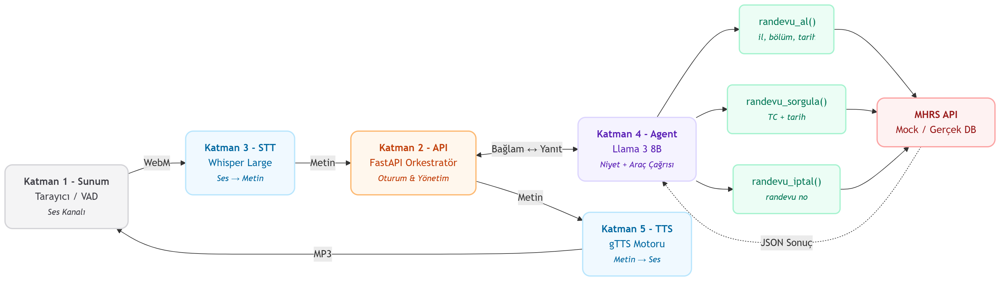
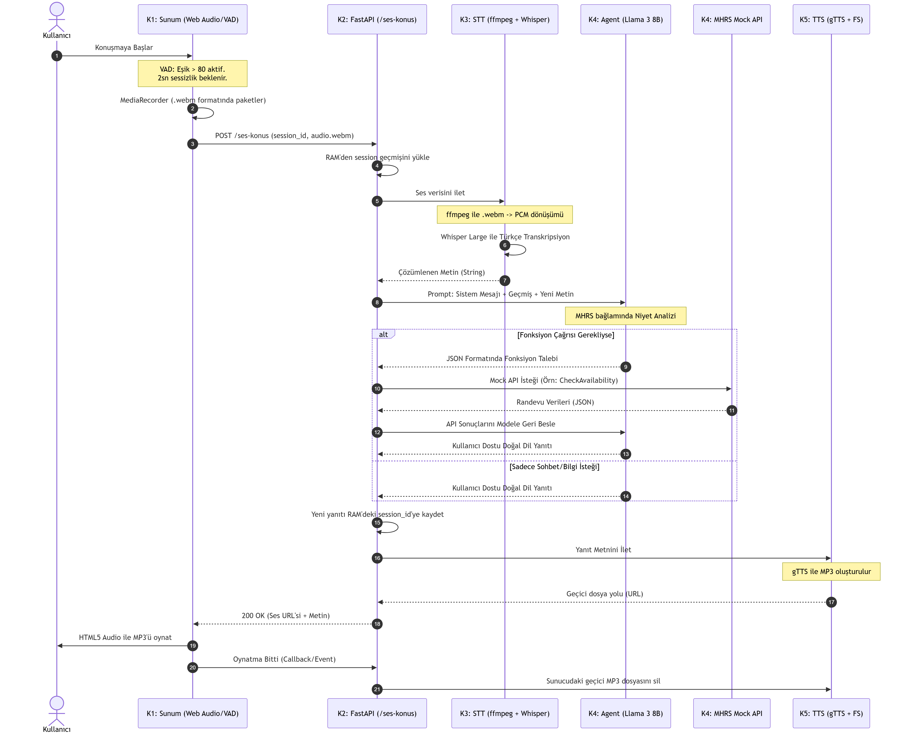

# Otonom MHRS Randevu Asistanı (LLM & STT Tabanlı)

Bu proje, hastaların sesli komutlarını anlayarak merkezi hekim randevu sistemi (MHRS) üzerinde otonom işlemler (randevu alma, iptal, sorgulama) gerçekleştirebilen yapay zeka destekli bir asistan mimarisidir.

## 🏗️ Sistem Mimarisi

* **STT (Sesten Metne):** OpenAI Whisper Large motoru.
* **LLM (Yapay Zeka):** Llama 3 8B (Ollama yerel sunucusu üzerinden).
* **Backend:** FastAPI asenkron Python sunucusu.
* **Mock API:** C# benzeri yapılandırılmış yerel randevu yönetim simülasyonu.

## 🚀 Kurulum Adımları

* 📚 [Model Eğitim Süreci ve Colab Notebook](docs/FINE_TUNING.md)
* 🦙 [OLLAMA Üzerinden MODEL İle Konuşma](docs/OLLAMA_API.md)
* 🧠 [MHRS Agent Kurulumu](docs/MHRS_AGENT.md)
* 🚀 [MHRS Mock API - C# / .NET 8 Entegrasyon Rehberi](docs/MOCKUP_API.md)
* 📊 [Testlerin Koşulması](docs/AGENT_TEST.md)
  

**High Level Design**

**Low Level Design**

